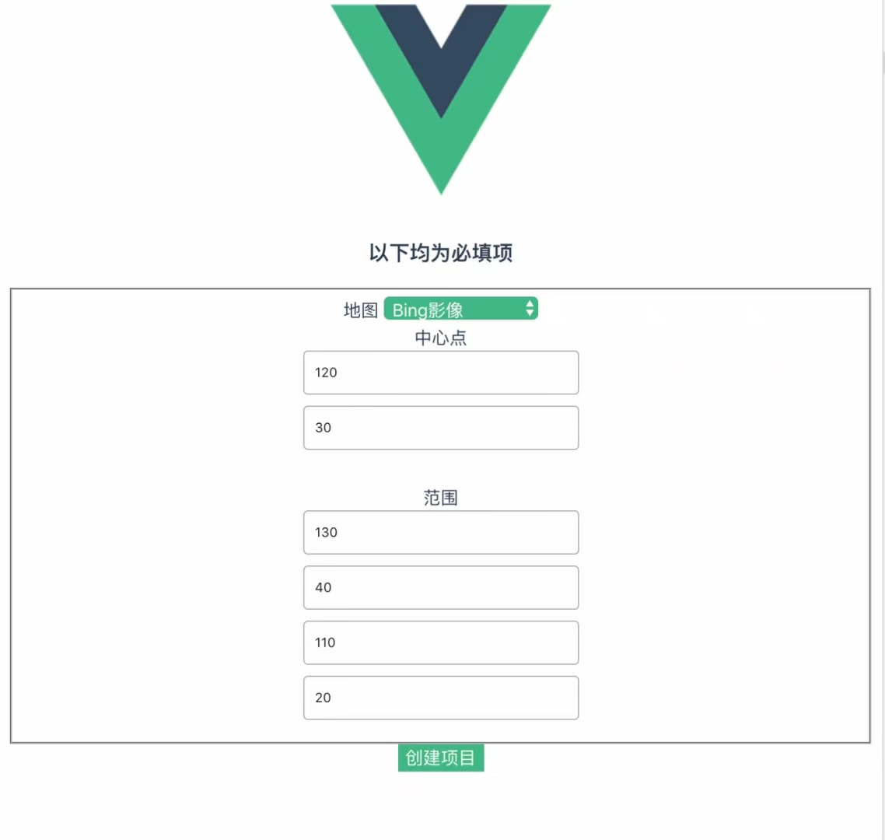

# This is the course design of my freshman webgis
It is also the beginning of my road to java web

# webgis project
The front end is a native vue app, the back end is a java project, and the front end uses openlayers, which realizes the vectorization operation of remote sensing images and supports the export function of various coordinate systems, such as 4326, etc.

## Project focus

### The project adopts a front-end and back-end separation design

#### front end
Dependent libraries: openlayers, jquery, vue, vue element.
Achieved: basic authority control, project operation export, point, line, surface and other operations.

### rear end
Dependent libraries: durid, mybatis, sprintboot, gson, redis, etc. See pom.xml for details

### Basic effect

### note
1. Separated design, lib and js in the support folder can be deployed separately.
2. Separation of front and back ends, supporting high-concurrency design, all modules have been micro-serviced and processed into APIs.

### Welcome to my personal website crazyweirdo.xyz
